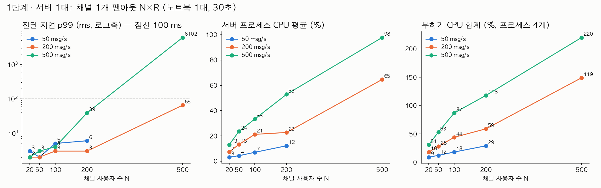
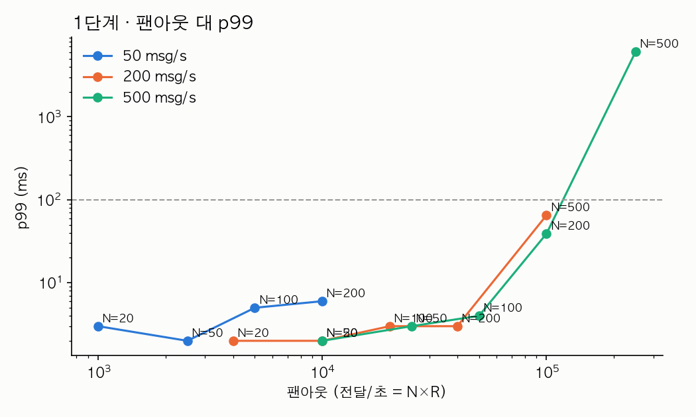

# 1단계(로컬 대조) · 맥북에서 잰 서버 1대의 한계

이 문서는 **로컬 맥북(Apple M5)** 측정이다. 정본 1단계는 EC2 t3.small 에서 다시 잰 [01-single-server-limit.md](01-single-server-limit.md) 이고, 이 문서는 "노트북에선 25만 전달/초까지 가야 무너진다" 는 대조용으로만 남긴다.

측정일 2026-09-30. 원시 결과 `bench/results/01-local/` (`n<N>_r<R>.json` 전달 기록, `.res` 요약, `.cpu` 1초 표본, `.app.log` 서버 로그).

## 조건

- **노트북 1대**(Apple M5, 10코어)에서 부하기·채팅 서버·Redis·MySQL 이 같이 돈다. 절대값은 이 기계의 값이고, 다른 표·다른 단계와는 **구조 간 차이**로만 비교한다.
- 채팅 서버 1대(3001), `CHAT_REDIS_ADAPTER=off`(Redis 를 거치지 않는 로컬 브로드캐스트). Node 22, Socket.IO 4.8, 게이트웨이는 PAD 코드 그대로, DB 계층은 대역(`bench/fake-chat.service.ts`, `online_users` 만 MySQL).
- 채널 1개에 사용자 N 명, 전원이 돌아가며 초당 R 개 메시지 → 서버가 초당 N×R 건을 전달한다(팬아웃). 조합당 1회, 30초.
- 부하기 `bench/load.js --workers 4`: 사용자를 4개 프로세스에 나눠 붙여 부하기 한 프로세스가 먼저 막히는 일을 줄였다. 부하기 CPU 는 4개 프로세스의 합이고, 어느 한 프로세스가 90% 를 넘는 셀은 없었다(최대 셀에서 프로세스당 51~58%).
- 서버 CPU 는 `top` 1초 표본의 부하 구간 평균·피크. 전달률은 송신 후 8초 안에 닿은 비율.
- 무릎 기준: p99 > 100 ms 또는 전달률 < 99.9%.

## 결과

| N | R (msg/s) | 팬아웃 (전달/초) | 전달률 | p50 / p99 / max (ms) | 서버 CPU 평균 / 피크 (%) | 서버 RSS 최대 (MB) | 부하기 CPU 합 (%) |
|---:|---:|---:|---:|---|---|---:|---:|
| 20 | 50 | 1,000 | 100% | 1 / 3 / 17 | 3 / 17 | 178 | 9 |
| 20 | 200 | 4,000 | 100% | 1 / 2 / 10 | 7 / 12 | 193 | 18 |
| 20 | 500 | 10,000 | 100% | 1 / 2 / 18 | 13 / 22 | 207 | 31 |
| 50 | 50 | 2,500 | 100% | 1 / 2 / 10 | 4 / 6 | 189 | 12 |
| 50 | 200 | 10,000 | 100% | 1 / 2 / 5 | 13 / 17 | 205 | 28 |
| 50 | 500 | 25,000 | 100% | 1 / 3 / 22 | 24 / 36 | 158 | 53 |
| 100 | 50 | 5,000 | 100% | 1 / 5 / 25 | 7 / 11 | 156 | 18 |
| 100 | 200 | 20,000 | 100% | 1 / 3 / 12 | 21 / 27 | 161 | 44 |
| 100 | 500 | 50,000 | 100% | 1 / 4 / 12 | 33 / 46 | 174 | 87 |
| 200 | 50 | 10,000 | 100% | 1 / 6 / 16 | 12 / 16 | 155 | 29 |
| 200 | 200 | 40,000 | 100% | 1 / 3 / 60 | 23 / 27 | 156 | 59 |
| 200 | 500 | 100,000 | 100% | 2 / 39 / 54 | 53 / 68 | 363 | 118 |
| 500 | 200 | 100,000 | 100% | 3 / 65 / 103 | 65 / 90 | 420 | 149 |
| **500** | **500** | **250,000** | 100% (8초 안) | **1,658 / 6,102 / 7,015** | **98 / 111** | 457 | 220 |

N=500 두 셀은 원래 격자(N ≤ 200)에서 무릎이 안 나와 추가한 것이다.

## 해석

- **팬아웃 10만 전달/초까지는 p99 100 ms 아래**다(200×500: 39 ms, 500×200: 65 ms). 같은 10만 건이라도 사용자 500명 쪽이 더 느리고 CPU 를 더 쓴다 — 메시지 하나를 500개 소켓에 쓰는 비용이 200개 소켓에 쓰는 것보다 크다.
- **무릎은 10만~25만 전달/초 사이에 있다.** 25만(500×500)에서 서버 프로세스 CPU 가 98% 평균(피크 111%)으로 Node 이벤트 루프 한 개가 포화했고, p50 이 1.7초, p99 가 6.1초로 뛰었다. 유실은 없었지만 8초 안에 겨우 닿은 것이라 채팅으로는 못 쓰는 상태다.
- 서버 CPU 가 팬아웃에 거의 비례해 오른다(1만 → 13%, 5만 → 33%, 10만 → 53~65%, 25만 → 98%). **채팅 서버는 CPU 한 코어에 묶인 단일 프로세스**라 여기서 더 받으려면 프로세스를 늘려야 하고, 프로세스가 둘이 되는 순간 "다른 프로세스에 붙은 사용자에게 어떻게 전달하나"가 문제가 된다. 그게 2단계다.
- 무릎 근처에서 서버 RSS 가 155 MB → 457 MB 로 커졌다. 쓰기 버퍼에 쌓인 메시지다.

## 한계

- 부하기와 서버가 같은 기계라 25만 셀에서는 부하기 4개 프로세스도 합계 220% 를 썼다. 프로세스당 90% 는 넘지 않았고 서버 쪽이 먼저 100% 에 닿았으므로 서버 한계로 읽었지만, 전용 부하 장비였다면 무릎 위치가 조금 다를 수 있다.
- 조합당 1회 측정이라 셀 간 작은 차이(예: 100×50 의 p99 5 ms 와 20×500 의 2 ms)는 잡음일 수 있다. 무릎 판정에 쓴 차이(39 ms → 6,102 ms)는 잡음 범위가 아니다.
- DB 계층이 대역이라 실제 서비스보다 메시지당 서버 비용이 작다. 실제 Prisma 저장이 들어가면 무릎은 더 낮은 팬아웃에서 온다.
- 서버 CPU 는 `top` 의 1초 표본이라 ±수 % 오차가 있다.
