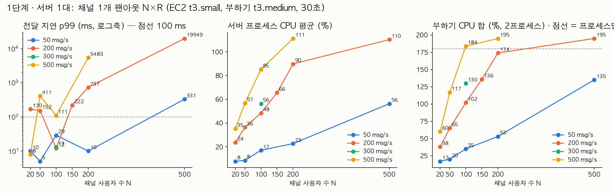
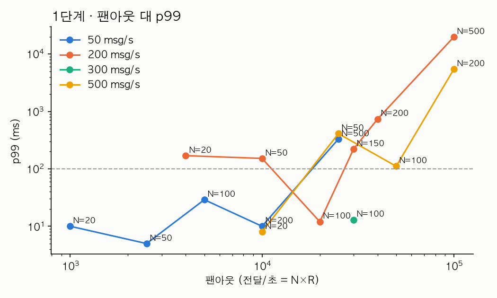

# 1단계 · 서버 1대의 한계 — 왜 2대가 필요한가

측정일 2026-09-30. 원시 결과 `bench/results/01/` (`n<N>_r<R>.json.gz` 전달 기록, `.res` 요약 2줄, `.cpu` 1초 표본, `.log` 부하기 로그, `.app.log` 서버 로그). 로컬 맥북에서 먼저 잰 대조 결과는 [01-local-macbook.md](01-local-macbook.md).

## 조건

- **서버**: dev 와 같은 EC2 **t3.small 1대**(2 vCPU, 2 GB, Ubuntu). 이 단계는 채팅 서버 프로세스 **1개**(3001)만 띄우고 Redis(6390)·MySQL(도커)이 같은 박스에 동거한다. `CHAT_REDIS_ADAPTER=off` — Redis 를 거치지 않는 로컬 브로드캐스트.
- **부하기**: 별도 EC2 **t3.medium**(2 vCPU, 4 GB), 같은 VPC 사설망(10.0.1.x). `bench/load.js --host 10.0.1.106 --workers 2` 로 사용자를 프로세스 2개에 나눠 붙인다. 부하기 CPU 는 두 프로세스의 합(%)이고, **합이 180%(프로세스당 90%)를 넘는 셀은 "부하기 한계"** 로 표시했다 — 그 셀의 지연은 서버 탓인지 부하기 탓인지 가를 수 없다.
- Node 22, Socket.IO 4.8, 게이트웨이는 PAD 코드 그대로, DB 계층은 대역(`bench/fake-chat.service.ts`, `online_users` 만 MySQL).
- 채널 1개에 사용자 N 명, 전원이 돌아가며 초당 R 개 메시지 → 서버는 초당 **N×R 건**을 전달한다(팬아웃). 조합당 1회, 30초.
- 서버 CPU 는 `/proc/<pid>/stat` 1초 차분의 부하 구간 평균·피크(프로세스 기준이라 GC 스레드 때문에 100% 를 넘을 수 있다). 전달률은 송신 후 8초 안에 닿은 비율.
- 지연은 두 가지로 적는다. **p99(전체)** 는 30초 전체의 p99 이고, **초별 p99 중앙값**은 1초 단위 p99 의 중앙값이다. 앞의 것은 두세 번의 순간 정체에 끌려가고, 뒤의 것이 정상 상태다. `>100 ms 초` 는 초별 p99 가 100 ms 를 넘은 초의 수(30초 중).
- 무릎 기준: p99 > 100 ms 또는 전달률 < 99.9%.

## 결과

| N | R (msg/s) | 팬아웃 (전달/초) | 전달률 | p50 / p99 / max (ms, 전체) | 초별 p99 중앙값 / >100 ms 초 | 서버 CPU 평균 / 피크 (%) | 부하기 CPU 합 (%) | 비고 |
|---:|---:|---:|---:|---|---|---|---:|---|
| 20 | 50 | 1,000 | 100.0% | 2 / 10 / 29 | 4 / 0 | 8 / 33 | 17 |  |
| 20 | 200 | 4,000 | 100.0% | 2 / 170 / 391 | 4 / 2 | 24 / 94 | 38 |  |
| 20 | 500 | 10,000 | 100.0% | 2 / 8 / 29 | 6 / 0 | 35 / 59 | 60 |  |
| 50 | 50 | 2,500 | 100.0% | 2 / 5 / 9 | 4 / 0 | 8 / 15 | 20 |  |
| 50 | 200 | 10,000 | 100.0% | 2 / 152 / 256 | 5 / 2 | 36 / 100 | 65 |  |
| 50 | 500 | 25,000 | 100.0% | 2 / 411 / 759 | 8 / 3 | 57 / 97 | 117 |  |
| 100 | 50 | 5,000 | 100.0% | 3 / 29 / 68 | 7 / 0 | 17 / 60 | 35 |  |
| 100 | 200 | 20,000 | 100.0% | 3 / 12 / 64 | 8 / 0 | 48 / 75 | 102 |  |
| 100 | 300 | 30,000 | 100.0% | 3 / 13 / 45 | 6 / 0 | 56 / 86 | 130 | 추가 셀 |
| 100 | 500 | 50,000 | 100.0% | 5 / 111 / 211 | 29 / 1 | 85 / 108 | 184 | **부하기 한계** |
| 150 | 200 | 30,000 | 100.0% | 4 / 222 / 277 | 10 / 3 | 66 / 107 | 136 | 추가 셀 |
| 200 | 50 | 10,000 | 100.0% | 4 / 10 / 23 | 9 / 0 | 23 / 41 | 53 |  |
| 200 | 200 | 40,000 | 100.0% | 7 / 737 / 822 | 29 / 6 | 90 / 121 | 174 | 부하기 근접(87%/프로세스) |
| 200 | 500 | 100,000 | 100.0% | 1,501 / 5,483 / 9,059 | 4,363 / 30 | 111 / 126 | 195 | **부하기 한계** |
| 500 | 50 | 25,000 | 100.0% | 11 / 331 / 633 | 23 / 3 | 56 / 106 | 135 |  |
| 500 | 200 | 100,000 | **85.8%** | 3,716 / 19,949 / 24,394 | 10,173 / 30 | 110 / 126 | 195 | **부하기 한계** |
| 500 | 500 | 250,000 | — | — | — | — | — | 측정 실패(아래) |

500×500 은 부하기 자식 프로세스 하나가 사용자 250명 조인을 30초 안에 못 끝내 타임아웃으로 죽었고(`n500_r500.log`), 결과 JSON 이 없다. 100k 셀에서 이미 부하기가 포화한 상태라 다시 돌려도 서버 한계로 읽을 수 없어 재실행하지 않았다.

## 해석

- **정상 상태만 보면 3만 전달/초까지는 문제없다.** 초별 p99 중앙값이 팬아웃 3만(100×300, 150×200)까지 10 ms 안팎이고, 4만~5만(200×200, 100×500)에서 29 ms 로 오른다. 유실은 10만 전달/초(500×200)에서 처음 나왔다(85.8%).
- **전체 p99 는 그보다 훨씬 일찍, 팬아웃 4천(20×200)에서도 170 ms 가 나온다.** 그런데 그 셀의 초별 p99 중앙값은 4 ms 이고 100 ms 를 넘은 초는 30초 중 2초뿐이다. 서버 CPU 피크(94%)가 그 순간에 찍혀 있다 — 평균 24% 인 프로세스가 한두 번 1초 가까이 멈춘 것이다. 같은 무늬가 50×200(2초), 50×500(3초), 500×50(3초), 150×200(3초)에 있다. 30초 안에 두세 번 오는 이 정체의 원인은 이번 실측으로는 가르지 못했다(후보: V8 GC, t3 의 CPU 크레딧·스틸, ts-node 로 띄운 프로세스의 지연 컴파일). 서버 프로세스 CPU 와 기계 전체 CPU 가 같이 튀므로 서버 쪽 현상인 것은 분명하다.
- **무릎은 팬아웃 3만~5만 전달/초 사이**다. 3만(100×300)에서 서버 CPU 평균 56%·피크 86%, 초별 p99 6 ms 였고, 4만(200×200)에서 평균 90%·피크 121%, 초별 p99 29 ms·100 ms 넘는 초 6개, 전체 p99 737 ms 가 됐다. 이 두 셀은 부하기가 프로세스당 65~87% 로 아직 포화 전이라 서버 쪽 변화로 읽을 수 있다. 5만 이상은 부하기도 함께 포화해(184~195%) 숫자를 서버 탓으로만 돌릴 수 없지만, 서버 CPU 가 110% 로 붙어 있고 유실이 난 것은 부하기와 무관하게 서버가 한계라는 뜻이다.
- **채팅 서버는 CPU 한 코어에 묶인 단일 프로세스**라(Node 이벤트 루프 1개) t3.small 의 2 vCPU 중 하나만 쓴다. 팬아웃이 CPU 에 거의 비례해 오르므로(1만 → 23~36%, 3만 → 56~66%, 4만 → 90%) 여기서 더 받으려면 프로세스를 늘리는 수밖에 없고, 프로세스가 둘이 되는 순간 "다른 프로세스에 붙은 사용자에게 어떻게 전달하나"가 문제가 된다. 그게 2단계다.
- 로컬 맥북(M5)에서는 같은 코드가 10만 전달/초에서 p99 39~65 ms, 25만에서야 CPU 포화였다([01-local-macbook.md](01-local-macbook.md)). t3.small 은 그 1/3~1/5 지점에서 무너진다. 절대값은 기계 값이고, 이 실험에서 읽을 것은 "단일 프로세스가 CPU 한 코어에서 끝난다"는 구조다.

## 한계

- 조합당 1회다. 셀 간 작은 차이(예: 100×50 의 p99 29 ms 와 200×50 의 10 ms)는 잡음일 수 있고, 특히 전체 p99 는 순간 정체가 몇 번 걸리느냐에 따라 한 자릿수 ms 와 수백 ms 를 오간다. 무릎 판정에는 초별 p99 중앙값·CPU 평균·유실을 함께 썼다.
- 부하기가 t3.medium 한 대(2 vCPU)라 팬아웃 5만 이상은 부하기 한계로 표시했다. 그 셀들은 "서버가 이 정도로 나빠졌다"의 하한만 말해 준다.
- t3 는 버스트 인스턴스라 CPU 크레딧과 스틸의 영향을 받는다. 이번 실측 중 크레딧 잔량은 확인하지 않았다.
- DB 계층이 대역이라 실제 서비스보다 메시지당 서버 비용이 작다. 실제 Prisma 저장이 들어가면 무릎은 더 낮은 팬아웃에서 온다.
- 서버는 `ts-node`(transpile-only)로 띄웠다. 빌드된 JS 로 띄우면 초기 지연 컴파일 비용이 줄어 순간 정체 일부가 사라질 수 있다 — 확인하지 않았다.
