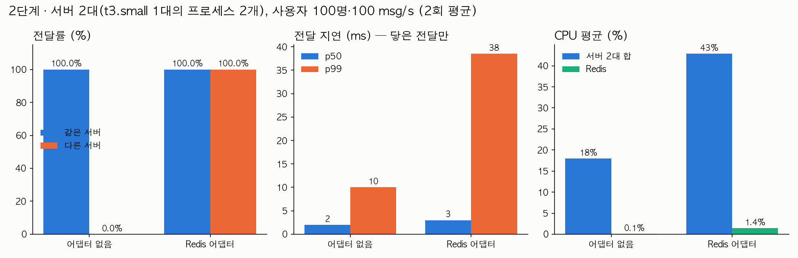

# 2단계 · 서버를 2대로 늘리면 — 어댑터 없음 → Redis 어댑터

측정일 2026-09-30. 원시 결과 `bench/results/02/` (`<이름>.json.gz` 전달 기록, `.res` 요약, `.cpu` 1초 표본, `.createch.json` 1:1 채팅방 생성 시험, `.app-300x.log` 서버 로그).

## 조건

- **서버**: dev 와 같은 EC2 t3.small 1대(2 vCPU, 2 GB)에 채팅 서버 **프로세스 2개**(3001, 3002) + Redis 6390(단일, Sentinel 없음) + MySQL(도커) 동거. 서버 2대가 2 vCPU 를 나눠 쓴다.
- **부하기**: 별도 t3.medium, 사설망. 사용자 100명을 두 서버에 번갈아 붙여(각 50명) 채널 1에 넣고, 전원이 돌아가며 초당 100개 메시지를 30초 보낸다. 서버 하나가 받은 메시지는 채널의 100명 전원에게 가야 하므로 전달의 절반(초당 5,000건)이 **다른 서버**에 붙은 사용자 몫이다. 1단계 무릎(3만~5만 전달/초)의 1/3 쯤 되는 팬아웃 1만 전달/초.
- (a) `CHAT_REDIS_ADAPTER=off`: Socket.IO 기본 인메모리 어댑터. (b) 어댑터 on: `@socket.io/redis-adapter` + ioredis, pub/sub 으로 서버 간 이벤트 중계. 각 2회.
- 1:1 채팅방 생성 시험(`bench/createch.js`): 3001 에 붙은 사용자 1이 3002 에 붙은 사용자 2와 `createChannel` 을 20번 → 사용자 2가 `channelAdded` 를 받는지 센다. 현재 코드(`server.to(socketId).emit`)와, 어댑터 도입 전 코드(`fetchSockets()` 에서 상대 소켓을 찾아 `.emit`, `bench/legacy-chat.gateway.ts`)를 각각 시험했다.
- CPU 는 `/proc` 1초 차분의 부하 구간 평균(서버 2개 합, Redis 별도).

## 결과

| | 어댑터 없음 (2회) | Redis 어댑터 (2회) |
|---|---:|---:|
| 같은 서버 사용자 전달률 | 100% / 100% | 100% / 100% |
| 다른 서버 사용자 전달률 | **0% / 0%** (150,000건 전부 유실) | **100% / 100%** |
| p50 (ms, 닿은 전달만) | 2 / 2 | 3 / 3 |
| p99 (ms, 전체) | 5 / 15 | 20 / 57 |
| 초별 p99 중앙값 (ms) | 4 / 4 | 5 / 7 |
| 서버 2개 CPU 합 평균 (%) | 18 / 19 | 40 / 46 |
| Redis CPU 평균 (%) | 0 / 0 | 1 / 2 |
| 1:1 채팅방 생성, 상대가 `channelAdded` 받음 | **0 / 20** | **20 / 20** |

어댑터 도입 전 게이트웨이 + 어댑터 없음(1회): 1:1 채팅방 생성 20번 중 **20번 모두 예외**, 생성자도 `channelCreated` 를 못 받음(0/20). 서버 로그(`legacy_off_r1.app-3001.log`)에 20건:

```text
ERROR [WsExceptionsHandler] Cannot read properties of undefined (reading 'emit')
TypeError: Cannot read properties of undefined (reading 'emit')
    at LegacyChatGateway.handleCreateChannel (bench/legacy-chat.gateway.ts:88:18)
```



## 해석

- **서버를 2대로 나누는 순간, 어댑터가 없으면 다른 서버에 붙은 사용자에게는 한 건도 안 간다.** `server.to(room).emit` 은 그 프로세스 메모리에 있는 소켓만 안다. 같은 서버끼리는 100% 라서 한 서버에서만 시험하면 발견되지 않는다.
- **1:1 채팅방 생성은 두 가지로 깨진다.** 옛 코드는 `fetchSockets()` 로 상대 소켓을 찾다가 `undefined.emit` 예외를 내서 생성자 쪽까지 실패한다. 예외를 고친 현재 코드는 조용히 상대에게 안 간다(0/20) — 예외가 안 나서 더 늦게 발견되는 종류다. 어댑터가 있어야 20/20 이 된다: `server.to(socketId)` 가 Redis 를 거쳐 상대 서버로 간다.
- **어댑터의 비용**: p50 이 2 → 3 ms, 초별 p99 중앙값이 4 → 5~7 ms 로 늘었다. Redis 한 번 왕복이 더해진 값이다. Redis 자체는 1~2% 로 거의 놀고 있다.
- 서버 CPU 합이 18% → 40~46% 로 두 배 넘게 늘었는데, 이 차이의 대부분은 어댑터 오버헤드가 아니라 **실제로 전달한 양이 두 배**라서다. 어댑터 없음에서는 다른 서버 몫 5,000건/초를 버렸고, 어댑터 on 에서는 그것까지 다 보냈다(1만 건/초). 순수 어댑터 오버헤드(pub/sub 직렬화·역직렬화)를 따로 재려면 같은 전달량에서 비교해야 하는데 이번 실험 구성으로는 분리하지 못했다.
- 이 단계에서 **Redis 가 서버 사이의 유일한 통로**가 됐다. 그것이 죽으면 어떻게 되는지가 3단계다.

## 한계

- 회차 2회다. 전체 p99 는 1단계와 같은 순간 정체(30초 중 한두 초의 CPU 피크)에 끌려간다 — on_r2 의 p99 57 ms 는 100 ms 를 넘은 1초 때문이고 초별 중앙값은 7 ms 다. 구성 간 비교는 초별 p99 중앙값과 전달률로 하는 것이 맞다.
- 서버 2개가 t3.small 의 2 vCPU 를 나눠 쓰고 Redis·MySQL 까지 같은 박스라, 서버가 물리적으로 2대인 환경보다 서버 CPU 가 서로 간섭한다.
- 어댑터 오버헤드를 전달량과 분리해 재지 못했다(위).
