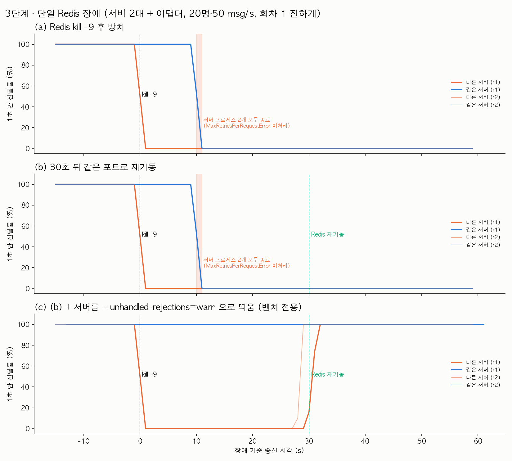

# 3단계 · Redis 1대가 죽으면 — 단일 장애점

측정일 2026-09-30. 원시 결과 `bench/results/03/` (`<이름>.json.gz` 전달 기록, `.res` 요약, `.cpu` 표본, `.alive` 부하 종료 시점 서버 프로세스 생존, `.app-300x.log` 서버 로그, `.log` 부하기 로그 + 장애 명령 출력).

## 조건

- **서버**: dev 와 같은 EC2 t3.small 1대(2 vCPU)에 채팅 서버 프로세스 2개(3001, 3002) + Redis 6390 **단일 1대(Sentinel 없음)** + MySQL(도커) 동거. 2단계 (b)와 같은 구성, `@socket.io/redis-adapter` + ioredis 기본 옵션(`maxRetriesPerRequest` 20, `retryStrategy` 기본).
- **부하기**: 별도 t3.medium, 사설망. 사용자 20명(서버당 10명)을 채널 1에 넣고 초당 50개 메시지를 75초. 부하 시작 약 15초 뒤 앱 박스에서 Redis 프로세스에 `kill -9`. 장애 시각은 앱 박스에서 명령을 실행한 epoch ms 를 받아 기록했다(두 박스 모두 Amazon Time Sync).
- (a) **dead**: 죽인 채 60초 방치. (b) **restart**: 30초 뒤 같은 포트로 Redis 를 다시 띄움. 각 2회.
- (c) **restart_warn**: (a)(b)에서 서버 프로세스가 죽어 버려 "재접속 복구"를 잴 수 없었기 때문에 추가한 회차. (b)와 같되 서버를 `node --unhandled-rejections=warn` 으로 띄워 미처리 promise 거부에 프로세스가 종료되지 않게 했다. **벤치 전용 플래그**이고 PAD 코드 변경이 아니다. 2회.
- 복구 시점 = 장애 이후 "그 뒤로 보낸 모든 메시지가 다른 서버 사용자에게 1초 안에 닿기 시작한" 송신 시각(장애 기준 초).

## 결과

| | (a) dead r1 / r2 | (b) restart r1 / r2 | (c) restart_warn r1 / r2 |
|---|---|---|---|
| 다른 서버 전달이 0 이 되는 시점 | 장애 +1 s | 장애 +1 s | 장애 +1 s |
| 같은 서버 전달 | **+10.5 s 까지 100%, 그 뒤 0%** | **+10.5 s 까지 100%, 그 뒤 0%** | 끝까지 100% |
| 서버 프로세스 (부하 종료 시점) | **둘 다 종료** | **둘 다 종료** | 둘 다 생존 |
| 다른 서버 전달 복구 | 안 됨 (60 s 창 끝까지) | 안 됨 — Redis 는 +30 s 에 돌아왔지만 서버가 이미 없음 | **Redis 재기동 +1.1 s / +0.5 s** (장애 기준 +31.5 s / +28.9 s) |
| 다른 서버 전달률 (75초 전체) | 20.7% / 20.9% | 20.8% / 20.5% | 70.8% / 80.3% |
| 유실된 다른 서버 전달 (건) | 29,750 / 29,650 | 29,690 / 29,810 | 10,950 / 7,390 |
| 1초 넘게 늦게 닿은 전달 (건) | 0 | 0 | 4,600 / 7,070 (최대 3.7 s / 1.9 s 지연) |



(c) 회차 2 는 장애가 부하 17초에 걸려 재기동이 장애 기준 +29.4 s 였다. 그래프의 "Redis 재기동" 선은 +30 s 명목 위치다.

서버 로그(`dead_r1.app-3001.log`, 두 서버·네 회차 동일):

```text
LOG  [RedisIoAdapter] redis sub reconnecting
WARN [RedisIoAdapter] redis pub error: connect ECONNREFUSED 127.0.0.1:6390
... (약 10초 동안 재접속 시도 20회) ...
/home/ubuntu/pad-backend/node_modules/ioredis/built/redis/event_handler.js:182
    self.flushQueue(new errors_1.MaxRetriesPerRequestError(maxRetriesPerRequest));
MaxRetriesPerRequestError: Reached the max retries per request limit (which is 20).
```

## 해석

- **Redis 가 죽으면 서버 사이의 전달은 그 즉시 0 이 된다.** 어댑터는 모든 서버 간 이벤트를 Redis pub/sub 하나에 태우므로 대체 경로가 없다. 같은 서버 안의 전달은 Redis 를 거치지 않아 처음엔 살아 있다.
- **그런데 10.5초 뒤 서버 프로세스 자체가 죽는다.** ioredis 는 재접속을 20번(약 10초, 50 ms → 1 s 까지 늘어나는 간격) 시도한 뒤, 그동안 오프라인 큐에 쌓아 둔 명령을 `MaxRetriesPerRequestError` 로 거부한다. `@socket.io/redis-adapter` 는 `pubClient.publish()` 가 돌려주는 promise 를 받지 않으므로 이 거부가 **미처리 promise 거부**가 되고, Node 15+ 기본값(`--unhandled-rejections=throw`)에서 프로세스가 종료된다. 서버가 죽으니 같은 서버 전달도 0 이 되고 사용자 20명 전원이 끊긴다. Redis 1대의 장애가 채팅 서버 전체의 장애로 번지는 경로다.
- **(b) 에서 30초 뒤 Redis 를 살려도 소용없었다.** 살릴 서버가 없다. 이 결과만 보면 "Redis 를 빨리 살리면 된다" 가 아니라 "Redis 가 10초 넘게 없으면 서버가 죽는다" 가 된다.
- **(c) 로 프로세스만 살려 두면** 같은 서버 전달은 끝까지 100% 이고, Redis 가 돌아온 뒤 0.5~1.1초 만에 ioredis 가 재접속·재구독해 다른 서버 전달이 100% 로 돌아온다. 장애 구간의 메시지는 두 갈래다 — 20회 재시도 창(+1~+10.5 s)에 쌓인 것은 거부돼 유실됐고, 그 뒤 ioredis 가 큐를 다시 열어 쌓아 둔 것(회차별로 +12 s 또는 +10 s 부터, 서버 둘 중 하나씩 시점이 다르다)은 재접속 뒤 한꺼번에 나가 최대 3.7초 늦게 닿았다. 즉 유실과 지연 배달이 섞이고, 어느 쪽이 될지는 재시도 카운터 상태에 달려 있다.
- 결론은 두 가지다. (1) **Redis 를 1대만 두면 그 1대가 채팅 서비스 전체의 단일 장애점**이다 — 그래서 4단계에서 자동 페일오버(Sentinel 또는 Cluster)를 비교한다. (2) 페일오버가 있어도 **10.5초 안에 끝나야** 서버가 안 죽는다. 4단계 Sentinel 의 복구 7~9초가 이 기준 안에 든다는 점이 중요하고, 그 여유가 크지 않다는 점도 중요하다. 별도로, 앱 쪽에서 publish 실패를 받아 주거나(ioredis `maxRetriesPerRequest: null` 또는 어댑터 오류 처리) 하는 방어는 코드 변경이라 이 실험 범위 밖에 두었다.

## 한계

- 회차 2회씩이다. 프로세스 종료 시점(+10.5 s)은 ioredis 기본 재시도 간격의 합으로 정해지는 값이라 네 회차가 초 단위로 같았다.
- (c) 는 진단용 플래그로 만든 상태라 실제 배포 구성이 아니다. "프로세스가 살아 있으면 재접속 복구는 1초 안" 이라는 사실만 가져간다.
- 서버 2개·Redis·MySQL 이 한 t3.small 에 있다. 다만 이 단계의 결과(전달 0, 프로세스 종료)는 CPU 경합과 무관한 구조적 현상이다.
- 1단계에서 본 순간 정체(전체 p99 와 초별 p99 중앙값의 차이)는 이 단계의 낮은 부하(1,000 전달/초)에서는 (a)(b)의 p99 4~18 ms 로 눈에 띄지 않았다.
