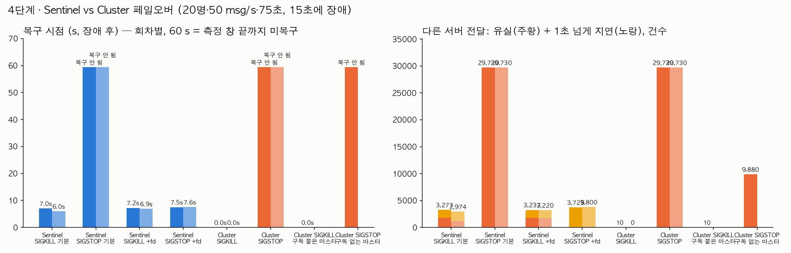
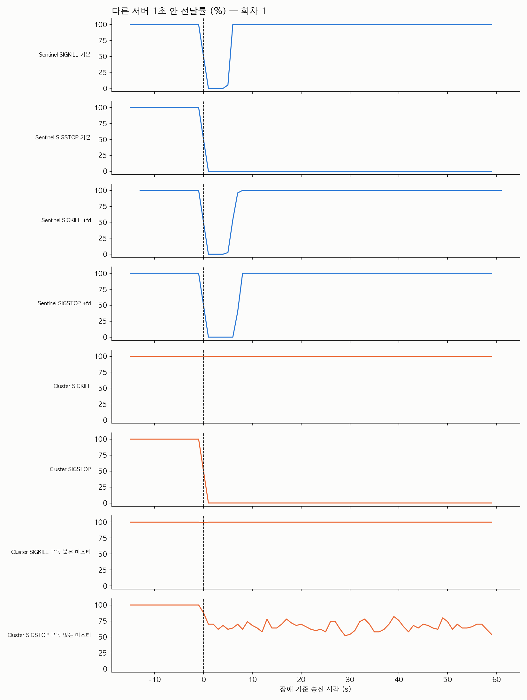
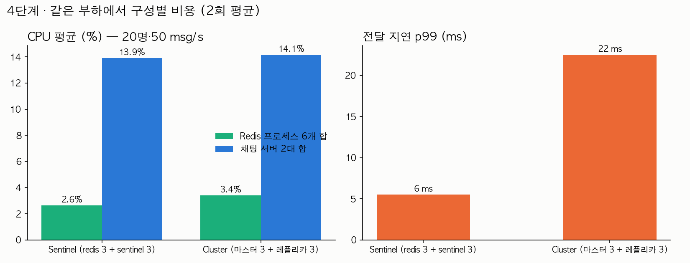

# 4단계 · Sentinel vs Cluster — 자동 페일오버와 그 비용

측정일 2026-09-30. 원시 결과 `bench/results/04/sentinel/`(8회), `bench/results/04/cluster/`(4회 + 진단 2회), `bench/results/04/cost/`(구성별 2회). 파일: `.json.gz` 전달 기록, `.res` 요약, `.sentinel-events`·`.cluster-events` Redis 쪽 장애 감지 로그, `.clients` 장애 직전 노드별 접속 목록(진단 회차), `_before/_after.stats` `INFO` 스냅숏(비용).

## 조건

- **서버**: dev 와 같은 EC2 t3.small 1대(2 vCPU)에 채팅 서버 프로세스 2개(3001, 3002) + Redis 프로세스 6개 + MySQL(도커) 동거. **부하기**: 별도 t3.medium, 사설망. 사용자 20명(서버당 10명), 초당 50개 메시지, 75초, 부하 시작 약 15초 뒤 장애. 3단계와 같은 부하.
- **Sentinel**(`bench/redis-sentinel.sh`): Primary 6380 + Replica 6381·6382 + Sentinel 26380~26382, `down-after-milliseconds 5000`, quorum 2. 앱은 `REDIS_SENTINELS=…` 로 접속. ioredis `failoverDetector` 기본(false)과 `true`(`REDIS_FAILOVER_DETECTOR=true`) 두 가지. 장애는 Primary 프로세스에 SIGKILL 또는 SIGSTOP, 각 2회.
- **Cluster**(`bench/redis-cluster.sh`): 마스터 3(7000~7002) + 레플리카 3(7003~7005), `cluster-node-timeout 5000`, `redis-cli --cluster create … --cluster-replicas 1`. 앱은 `REDIS_CLUSTER_NODES=…` 로 `new Redis.Cluster(...)`(이번에 추가한 `redis-client.factory.ts` 분기). 어댑터는 일반 pub/sub 그대로다 — **sharded pub/sub(`createShardedAdapter`)는 node-redis 클라이언트가 필요해 이번 범위 밖**이다. 장애는 마스터 하나에 SIGKILL 또는 SIGSTOP, 각 2회 + 대상 노드를 가려 고른 진단 2회.
- 복구 시점 = 장애 이후 "그 뒤로 보낸 모든 메시지가 다른 서버 사용자에게 1초 안에 닿기 시작한" 송신 시각. 유실 = 다른 서버 사용자에게 8초 안에 못 간 전달, 지연 = 1초 넘게 걸려 닿은 전달(건수 = 메시지 × 수신자).
- **비용 축**: 같은 부하(20명·50 msg/s·30초, 장애 없음)에서 Redis 프로세스 6개의 CPU 합, 노드별 `INFO stats/commandstats` 전후 차, 구성 스크립트 길이.

## 결과 — 페일오버

| 구성 | 장애 | ioredis 설정 | 복구 시점 (r1 / r2) | 유실 (건) | 1초 넘게 지연 (건) | Redis 쪽 감지 |
|---|---|---|---|---:|---:|---|
| Sentinel | SIGKILL | 기본 | **6.0 s / 7.0 s** | 1,200 / 1,760 | 1,774 / 1,517 | +sdown +5.0 s, +switch-master +6.2 s (r1) |
| Sentinel | SIGSTOP | 기본 | **복구 안 됨 / 안 됨** (60 s 창 끝까지) | 29,730 / 29,730 | 0 | +switch-master 는 +6~7 s 에 났음 |
| Sentinel | SIGSTOP | `failoverDetector: true` | **7.6 s / 7.5 s** | 0 / 0 | 3,800 / 3,729 | +switch-master +6.4 s (r1) |
| Sentinel | SIGKILL | `failoverDetector: true` | 7.3 s / 6.9 s | 1,750 / 1,730 | 1,487 / 1,490 | |
| Cluster | SIGKILL (마스터 7000 / 7002) | 기본 | **영향 없음** (0.0 s / 0.0 s) | 10 / 0 | 0 | FAIL +7.3 s, 새 마스터 선출 +8.0 s (r1) |
| Cluster | SIGSTOP (마스터 7002 / 7000) | 기본 | **복구 안 됨 / 안 됨** | 29,730 / 29,730 | 0 | 선출은 +6~7 s 에 됐음 |
| Cluster 진단 | SIGKILL, **구독 연결이 붙은 마스터** | 기본 | 영향 없음 (0.0 s) | 10 | 0 | |
| Cluster 진단 | SIGSTOP, **구독 없는 마스터** | 기본 | 복구 안 됨 — 다른 서버 전달이 창 내내 **약 2/3** 만 닿음 | 9,880 (33%) | 0 | |

같은 서버 사용자끼리는 모든 회차에서 100%. 서버 프로세스는 모든 회차에서 살아 있었다(3단계의 `MaxRetriesPerRequestError` 종료는 재접속이 10.5초 안에 끝나거나 아예 시도되지 않아 발생하지 않았다).

## 결과 — 비용 (같은 부하, 장애 없음, 2회)

| | Sentinel (redis 3 + sentinel 3) | Cluster (마스터 3 + 레플리카 3) |
|---|---:|---:|
| Redis 프로세스 6개 CPU 합 평균 (%) | 2.7 / 2.6 (평균 2.6) | 3.4 / 3.4 |
| Redis 프로세스 6개 RSS 합 (MB) | 44 | 48 |
| 채팅 서버 2개 CPU 합 평균 (%) | 14 / 14 | 14 / 14 |
| 전달 지연 p50 / p99 (ms) | 2 / 5 · 2 / 6 | 2 / 23 · 2 / 22 |
| 초별 p99 중앙값 (ms) | 4 / 4 | 10 / 7 |
| PUBLISH 가 처음 닿는 노드 | Primary 1대에 전부 (30초 동안 1,583건) | 마스터 3대에 약 1/3 씩 (노드당 명령 535~576건) |
| 그 뒤 전파 | Primary → Replica 2대에 복제 스트림으로 (replica 도 `cmdstat_publish` 1,646 증가, repl_out 755 KB) | 받은 마스터 → 나머지 5개 노드에 클러스터 버스로 (Redis 7.0 의 `cluster_stats_messages_publish_*` 카운터는 첫 스냅숏에 키가 없어 차분을 못 냈다) |
| 구독자 위치 | Primary (`pubsub_channels` 9) | 서버 2개의 구독이 **무작위로 노드 하나**에 붙음 (두 회차 모두 한 마스터에 8채널, 나머지 0) |
| 구성 스크립트 | 24줄: redis-server 3 + sentinel.conf 3 + 기동 3 | 20줄: redis-server 6 + `--cluster create` 1 + `cluster_state:ok` 대기 |

## 해석

- **SIGKILL 은 둘 다 넘긴다.** Sentinel 은 6~7초(감지 5초 + 승격 1초 + 재접속) 만에 돌아오고, 그 사이 메시지는 유실(1,200~1,760건)과 지연 도착(1,500~1,800건, 최대 7초)으로 갈린다. Cluster 는 앱이 **장애를 거의 못 느꼈다**: ioredis Cluster 의 구독 연결은 노드가 끊기면 즉시 다른 노드로 옮겨 붙고(`ClusterSubscriber`, 재시도 없이 `end` 이벤트에서 재선택), PUBLISH 는 키 없는 명령이라 무작위 마스터로 가므로 죽은 노드로 간 것만 재시도된다. 클러스터 자체의 마스터 선출(+7~8초)이 끝나기 전에 앱은 이미 다른 노드로 옮겨 가 있었다. 구독이 붙은 마스터를 골라 죽여도 같았다(유실 10건 = 메시지 1개).
- **SIGSTOP 은 둘 다 기본 설정으로는 못 넘긴다.** 프로세스가 멈추면 TCP 는 열린 채라 클라이언트에 아무 오류도 오지 않고, 구독 연결은 멈춘 노드에 그대로 남는다. Sentinel 쪽은 `failoverDetector: true` 로 +switch-master 이벤트를 구독하게 하면 7.5초에 복구되고 **유실 0** 이다(멈춘 동안의 publish 는 큐에 쌓였다가 최대 8.5초 늦게 전부 도착). **Cluster 쪽은 대응하는 스위치가 없다** — 구독 연결은 명령을 보내지 않으니 `commandTimeout` 으로도 못 잡고, 클러스터가 새 마스터를 뽑아도(+6~7초) 앱의 구독은 멈춘 노드에 남는다. 두 서버의 구독이 한 노드에 몰려 있던 회차에서는 다른 서버 전달이 0 이 됐고, 구독이 없는 마스터를 멈춘 진단 회차에서는 그 노드로 무작위 배정된 약 1/3 의 PUBLISH 가 응답 없이 매달려 창 내내 2/3 만 닿았다(publish 쪽은 `commandTimeout` 으로 막을 수 있겠지만 실측하지 않았다).
- **비용은 이 규모에서 둘 다 미미하다.** Redis 6개 합쳐 CPU 3% 안팎, 메모리 45~50 MB. 차이는 지연에서 났다 — Cluster 의 초별 p99 중앙값 7~10 ms 대 Sentinel 4 ms. PUBLISH 가 닿은 마스터에서 구독자가 붙은 노드까지 클러스터 버스를 한 번 더 건너기 때문으로 보이나, 홉 수를 직접 세지는 못했다(버스 카운터 차분 실패).
- **PAD 의 선택은 Sentinel + `failoverDetector: true`** 다. 이유: (1) 이 서비스의 Redis 는 pub/sub 중계와 작은 키-값뿐이라 샤딩할 데이터가 없다 — Cluster 의 장점(쓰기 분산·메모리 분할)이 쓰일 데가 없고, 일반 pub/sub 은 어차피 모든 노드로 퍼진다. (2) 실측한 두 장애 유형을 모두 기본 옵션 하나로 넘기는 쪽이 Sentinel 이다. Cluster 는 SIGKILL 에 더 매끄럽지만 SIGSTOP 류(프로세스 멈춤·네트워크 단절 후 반쯤 살아 있는 노드)에 앱 쪽 대책이 없다. (3) 구성이 단순하고 ioredis 단일 노드 코드 경로와 같다(`duplicate()`·pub/sub 동작이 검증돼 있다).
- **트레이드오프**: Sentinel 은 SIGKILL 에 6~7초 공백과 메시지 유실이 있다. Cluster 는 그 공백이 없다. 채팅에서 6초 공백이 허용되는지는 제품 판단이고, 줄이려면 `down-after-milliseconds` 를 낮추는 것(오탐 위험과 맞바꿈)이 첫 손잡이다.
- **다시 볼 조건**: Redis 에 pub/sub 외 데이터가 쌓여 한 대 메모리를 넘거나, 팬아웃이 커져 Primary 한 대의 PUBLISH 처리·복제 대역폭이 병목이 되거나, node-redis 로 옮겨 sharded pub/sub 을 쓸 수 있게 되면 Cluster 를 다시 잰다. 3단계에서 본 10.5초 한계(ioredis 재시도 20회 뒤 서버 종료)도 어느 쪽을 고르든 앱에서 막아야 한다.

## 한계

- 회차 2회(진단은 1회)다. Sentinel 복구 시점의 회차 간 편차는 1초 안이었다.
- Cluster 는 앱의 구독이 어느 노드에 붙는지가 무작위라 결과가 대상 노드에 따라 달라진다. 4회 본 배치는 "두 서버가 서로 다른 마스터" 2회, "같은 마스터" 2회였다. 진단 회차로 두 극단을 확인했지만 경우의 수를 다 덮지는 못했다.
- Cluster 의 `commandTimeout` 조합, sharded pub/sub, 3노드 이상 규모의 클러스터 버스 부하는 실측하지 않았다.
- 비용 축은 1,000 전달/초의 낮은 부하에서 잰 값이라 두 구성의 CPU 차이가 잡음 수준이다. 1단계에서 본 무릎 부하(3만~5만 전달/초)에서의 Redis 비용은 이번에 재지 않았다.
- 서버 2개·Redis 6개·MySQL 이 t3.small 한 대에 있다. 1단계의 순간 정체(전체 p99 와 초별 p99 중앙값의 차이)는 이 부하에서는 p99 수십 ms 로만 보인다.
